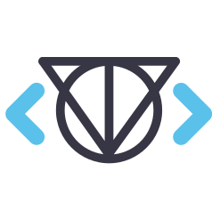
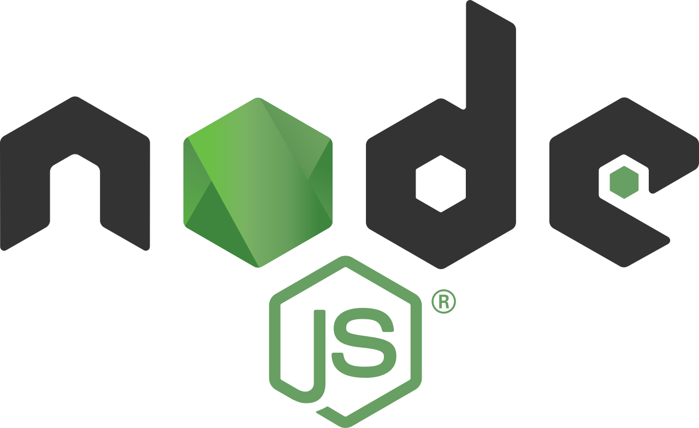
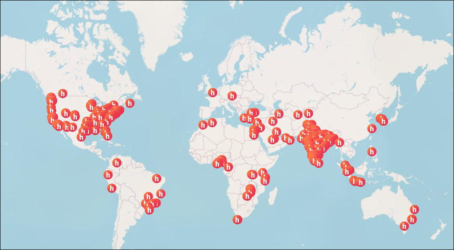
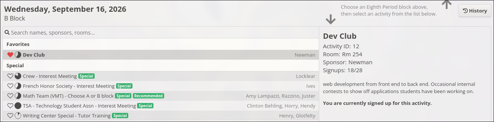
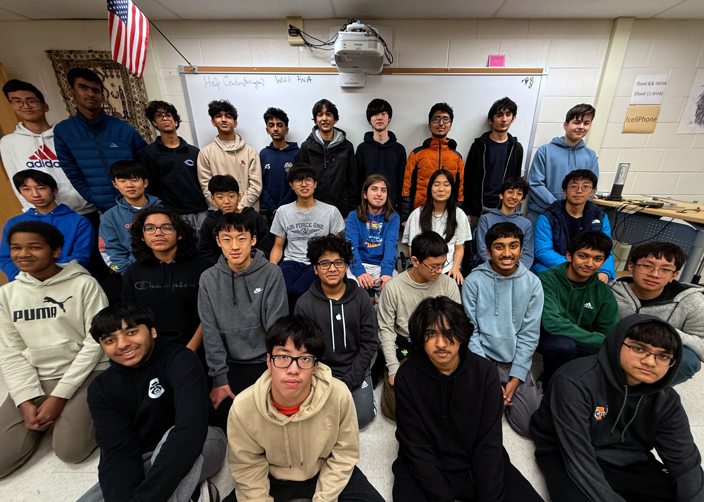
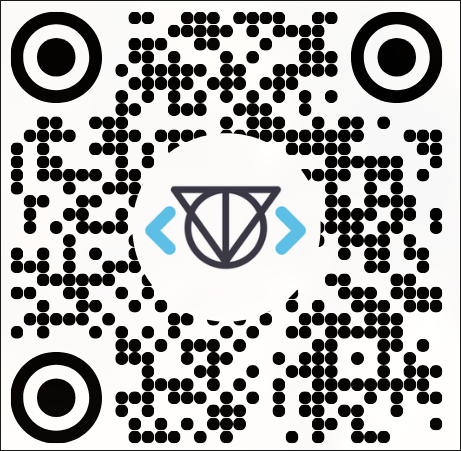

## https:/\/tjdev.club

# What is Dev Club?

TJHSST 26-27 Activity Fair

---

# **BUILD** together at Dev Club

- Dev Club is where people **learn** new web dev skills, **build** real projects, and **ship** finished projects to the world.

- Learn HTML, CSS, JS, React, Node.js, databases, and deployment.

---

# What is Hack Club?

- Hack Club is a global community of high school coding clubs where people collaborate on projects together.
- Earn free prizes like laptops, iPads, 3D printers, and electronics from workshops, YSWS, and hackathons!

---

# When and where do we meet?

- **Time**: every Wednesday during 8B from 3:20 to 4:00 (around 40 minutes).
- **Location**: second floor room 254 (Newman).
- Sign up on Ion!

---

# Who can come?

- Experienced developers, curious beginners -- anyone!
- Start from anywhere and learn at your own pace.
- Want to contribute? You can host guest lectures and mentor others!

---
layout: last
---

 
 
 
 
 
 

# \</Welcome\>

